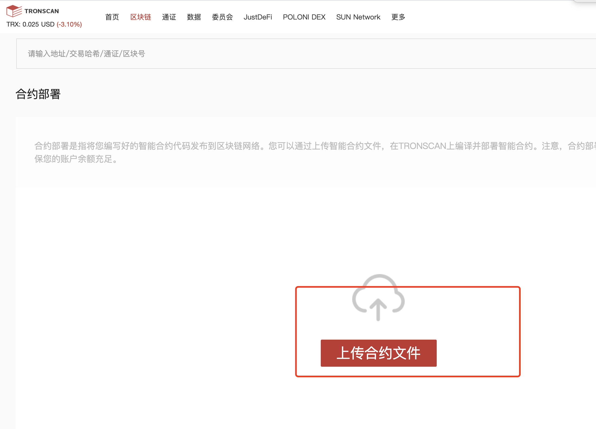
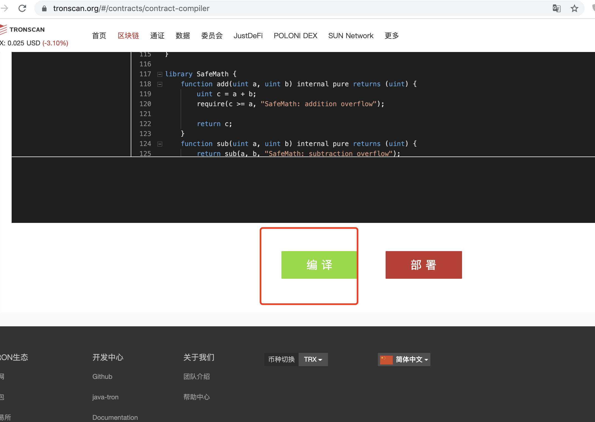
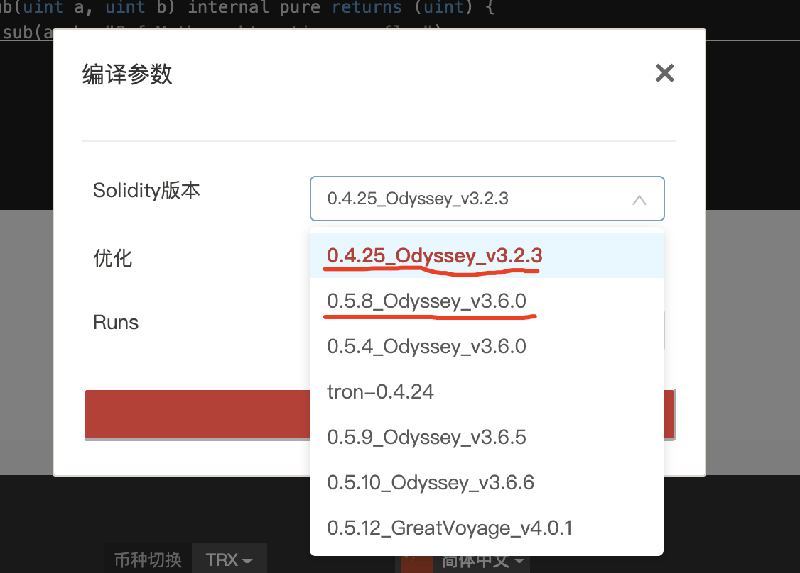
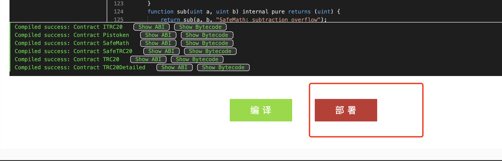
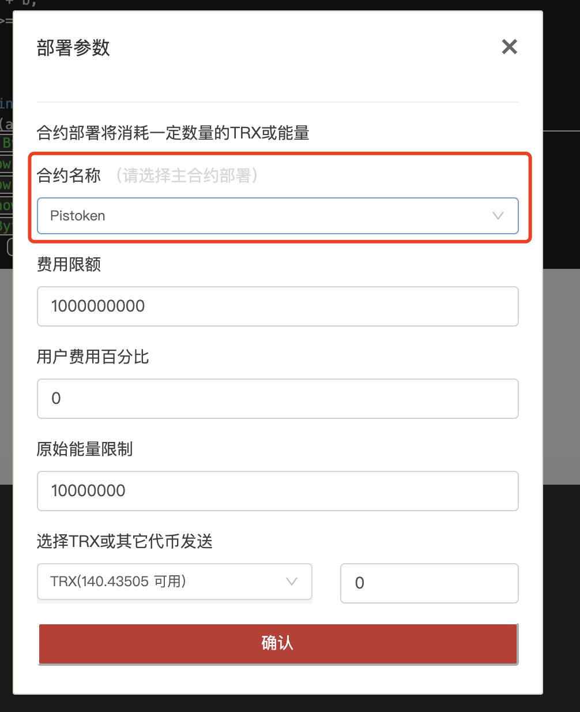
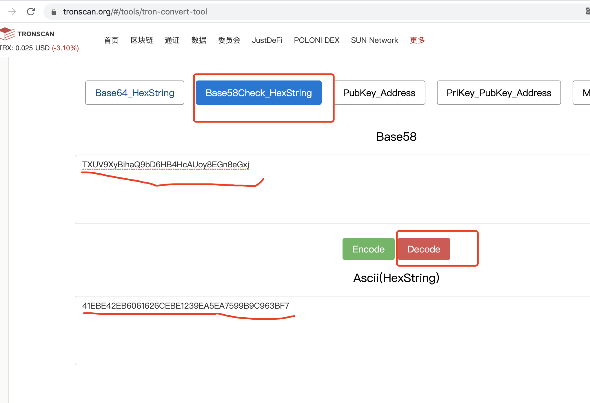
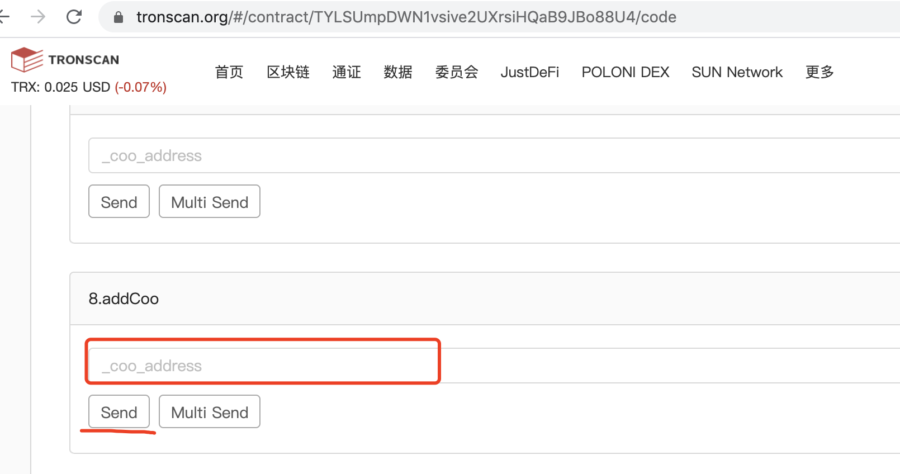
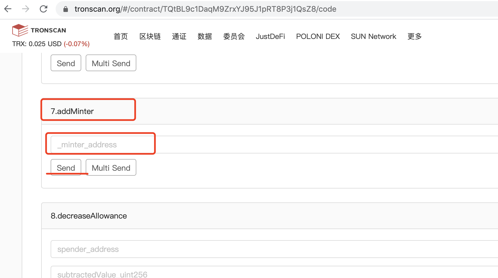

# Contract

部署说明： 

1. 统一使用https://tronscan.org/#/contracts/contract-compiler工具部署

   直接选择上传合约文件

   

2.选择编译

3.选择编译参数

选择一个，0.4.25 或者选择0.5.8

然后确认

3.然后选择  部署

4.

选择 部署的主合约文件，确认就可以了

2.编码转换工具

https://tronscan.org/#/tools/tron-convert-tool

对应的转换出的hex字符串

一.部署pistoken.sol ，选择编译器版本 0.5.8 ，选择主合约Pistoken， 成功后生成 pistoken的地址
二.部署PUSD.sol ，选择编译器版本 0.4.25 ，选择主合约PUSDToken ，成功后生成token地址

三.部署pusdswap.sol，部署之前先将pusdswap 文件中的588行中的 pusd的token地址(使用说明第二步中的转换成HEX)修改成第二步 生成的地址，然后，选择0.5.8  编译器，选择 主合约，pusdswap部署成功后需要 将pusdswap地址到 pusdswap的addCoo 函数进行设置，需要执行成功

四.部署pispool.sol, 
1.先将pistoken， PUSD的地址（HEX地址）在654，656行修改，

2.将668~691行的 24个地址替换

3.使用0.5.8编译器， 选择Pispool主合约，需要将 starttime的时间戳传入进去，就可以部署了；

4.部署成功后 ，需要将pispool的地址（HEX地址） 去pistoken的addMinter函数设置

5.然后需要设置RewardDistribution地址，在部署pispool的 setRewardDistribution函数设置，
6.设置成功后， 使用刚才设置的账号，操作pispool的notifyRewardAmount 函数，传入40000000000000000000000000       （1亿*0.4）预设总奖励值

二.接口相关的

合约接口：

A.合约 pispool：
需要调用的接口：

1.buySuperPower(address referrer, uint256 amount)  

用户购买算力函数，传入上级的地址，usdt的值（带精度）

2. stakePusd(uint256 amount) 

质押pusd 

3.withdraw(uint256 amount) 

提取pusd

4.daysbonus()

 dao算力每日分红，需要部署者调用

5.getReward()  

提取所有奖励

 6.   top49AdressCommpowerBonus(address currentAddress) returns(bool)  

社区49人 定时分红，传入address，需要后端定时调用

7.  top200AddresspowerBonus(address currentAddress, uint256 index)   returns(bool) 
 购买算力的前200人分红， 传入address，和第几位，从0开始

查询接口：

1.PisTotalSupply() public view returns(uint256)  

获得 pis的流通量

 2.totalAllUsers() public view returns(uint256)  

获得所有参与用户数

 3.totalBurnPis() public view returns(uint256)  

pis的总燃烧值

 4.totalPusdStake() public view returns(uint256) 

pusd总抵押值

5.PisSwapToUSDT(uint256 amount)                

pis 兑换usdt， 传入pis值

 6.totalSupply() public view returns (uint256)  

全网总的超导算力

 7.totalSupplyRefer() public view returns (uint256) 

总社区算力值

 8.earned(address account) public view returns (uint256) 

超导算力预计收益pis

 9.earnedRefer(address account) public view returns (uint256) 

社区算力预计收益pis

10.GetUserDatalite(address userAddress) public view returns(int256, uint256)

取得用户的超导算力，社区算力值

11.getTop49() public  returns(address[]) 取得前社区

算力前49人，返回 address列表

 12.getTop200() public  returns(address[] )  

取得购买算力的前 200人 ，返回 address列表

13.totalBurnPisToUsdt()

 取得兑换的pis的总额，返回pis兑换的usdt值

事件：

1.BuySuperPower(address indexed user, uint256 amount);  

用户，用户购买的usdt值2.Top49CommPowerBonus(address user, uint256 amount);  

top49社区算力分红，分红用户，分红pis值（带精度)

3.Top200PowerBonus(address user, uint256 amount, uint256 superpower );

 top200冲榜算力分红，分红地址，分红值，用户的超导算力

4.DaoPowerBonus(address user, uint256 amount);

 Dao算力分红，用户地址，分红usdt值（带精度）

5.StakedPusd(address indexed user, uint256 amount);

质押pusd， 质押用户，质押的pusd值

6.RewardPaid(address indexed user, uint256 reward); 

用户提取奖励，pis值

7.PisSwapToUsdt(address user, uint256 amount, uint256 usdtchange); 

pis兑换usdt，amount传入值，usdtchange兑换值

B.合约 pusdswap：

查询接口：

 1.getUserBuyPusd(address user ) public view returns(uint256) 
取得 地址 合成的pusd值

 2.getUserBurnPusd(address user ) public view returns(uint256)
取得用户归还的 pusd值

调用接口：

  1.trxInToPusdToken() public
使用trx 购买pusd

  2.pusdTotrx(uint256 amount) public
使用pusd 兑换成 trx，传入pusd的值，

  3.usdtInToPusdToken(uint256 amount) public
使用usdt 购买pusd

  4.pusdTousdt(uint256 amount) public
使用pusd 兑换成 usdt，传入pusd的值，

事件：
1.TrxInToPusdToken(address user, uint256 amount, uint256 pusd);
使用trx 购买pusd，用户地址，trx的值，兑换的pusd值

2.UsdtInToPusdToken(address user, uint256 amount);
使用usdt 购买pusd，用户地址，usdt的值

3.PusdTotrx(address user, uint256 amount, uint256 trx);
使用pusd 兑换成 trx， 用户地址，传入的pusd值，兑换的trx值

4.PusdTousdt(address user, uint256 amount);
使用pusd 兑换成 usdt 用户地址，传入的pusd值
